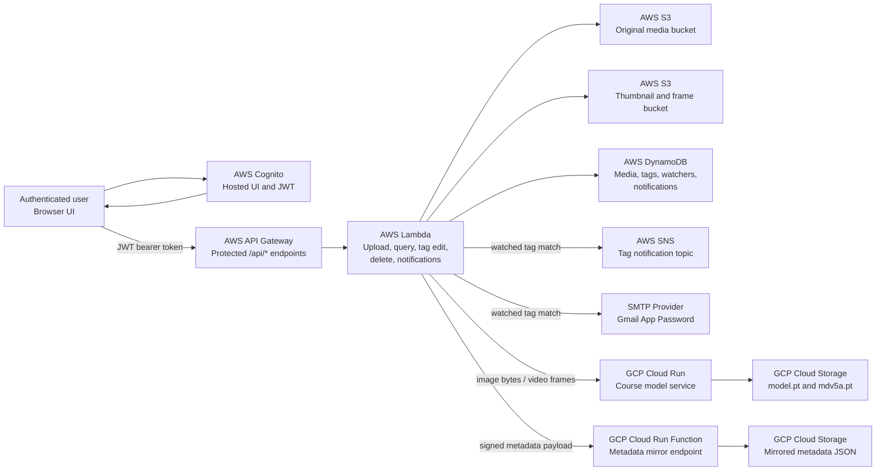

# Aussie EcoLens Architecture

Use this page as the architecture section source for the team report. For the final PDF, redraw the same component layout with official AWS and Google Cloud architecture icons, because the assignment explicitly asks for official icons in the report.

## Component Diagram

## Upload Processing Flow

1. The user signs in with AWS Cognito.
2. The browser sends the JWT to API Gateway.
3. API Gateway authorises the request and invokes Lambda.
4. Lambda calculates a SHA-256 checksum for deduplication.
5. Lambda stores the original media in the media S3 bucket.
6. For images, Lambda creates and stores a thumbnail.
7. For videos, Lambda uses ffmpeg to extract one frame per second and stores frame thumbnails.
8. Lambda sends the image or extracted frames to the GCP Cloud Run model service.
9. The GCP service loads `model.pt` and `mdv5a.pt` from GCP Cloud Storage and returns species tag counts.
10. Lambda writes metadata and tags to DynamoDB.
11. Lambda mirrors metadata to the GCP mirror endpoint.
12. If a watched tag matches, Lambda creates an in-app notification and publishes through SNS and SMTP.

## Official Icon Checklist For Report

Use the official AWS architecture icons for:

- Amazon Cognito
- Amazon API Gateway
- AWS Lambda
- Amazon S3
- Amazon DynamoDB
- Amazon SNS

Use the official Google Cloud architecture icons for:

- Cloud Run
- Cloud Storage

Use a simple external service icon or labelled box for:

- SMTP email provider
- Browser/user

